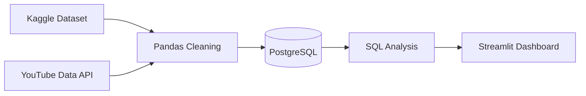
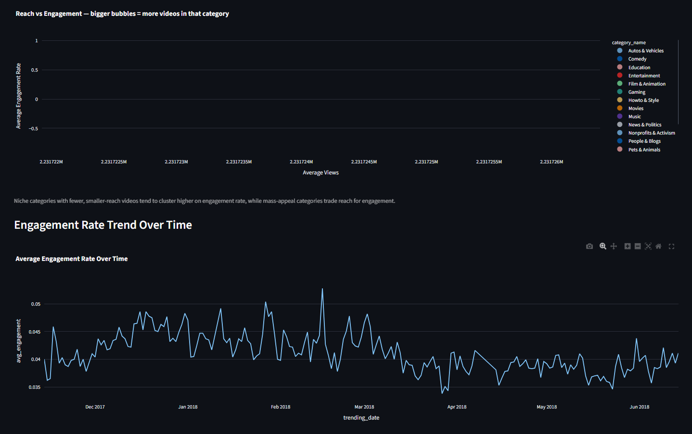
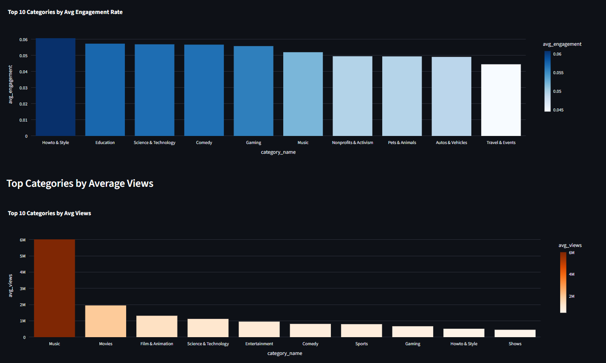
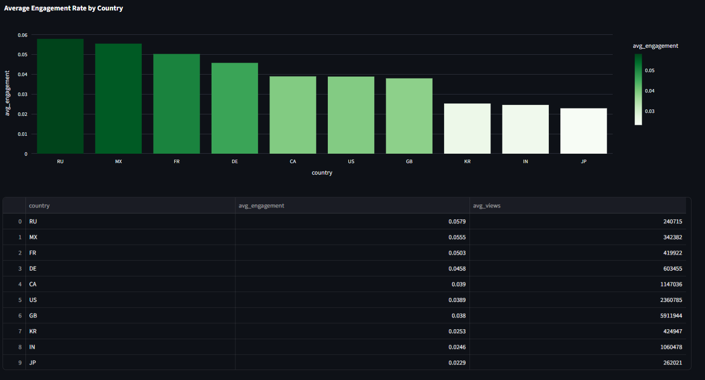

# YouTube Trending Analytics Pipeline

A data pipeline and dashboard analyzing 375K+ trending YouTube videos across 9 countries — built to answer a question I kept wondering about: does a video's category or country actually change how much its audience engages with it, or does everything just come down to views?

It combines a large historical dataset with live YouTube API data, cleans and loads everything into PostgreSQL, and surfaces the findings through an interactive Streamlit dashboard.

## What it does

- Combines the Kaggle YouTube Trending dataset (~376K records across US, CA, DE, RU, FR, MX, GB, IN, KR, JP) with live pulls from the YouTube Data API v3
- Cleans and transforms the data with Pandas — parses trending/publish dates, maps numeric category IDs to readable names, computes an engagement rate metric (`(likes + comments) / views`)
- Loads the cleaned data into a PostgreSQL database (running in Docker) with indexes on video ID, country, and category
- Runs SQL aggregation queries to compare engagement across categories and countries
- Visualizes everything in a Streamlit + Plotly dashboard with filters, KPI cards, and multiple chart views

## Architecture



## Dataset at a glance

| Metric | Value |
|---|---|
| Total rows | 375,942 |
| Unique videos | 184,287 |
| Countries | 9 |
| Missing data | Only `description` field (570 rows) |
| View range | 549 – 252,000,000 |

**Rows per country:** US 40,949 · CA 40,881 · DE 40,840 · RU 40,739 · FR 40,724 · MX 40,451 · GB 38,916 · IN 37,352 · KR 34,567 · JP 20,523

## Key insight

The clearest pattern in the data: **views and engagement rate tell two different stories.**

Categories like How-to & Style (6.07%), Education (5.73%), and Science & Technology (5.69%) had the highest engagement rates — despite having a fraction of the views that mass-appeal categories like Film & Animation or Entertainment pulled in.

The same pattern held at the country level. Russia (5.79% engagement, 240K avg views) and Mexico (5.55%, 342K avg views) out-engaged the UK (3.80% engagement, but 5.9M avg views) and the US (3.89%, 2.36M avg views) by a wide margin.

My takeaway: smaller, more dedicated audiences engage more per view than mass-appeal audiences do. It's not a universal rule — Korea, India, and Japan have moderate view counts but still land on the low end of engagement — but it held clearly enough across both categories and countries to be a real signal, not noise.

## Dashboard

  
  
 

The dashboard is organized into four tabs:
- **Overview** — a views-vs-engagement bubble scatter plot (bubble size = video count) and an engagement rate trend over time
- **By Category** — engagement rate and view count rankings across categories
- **By Country** — engagement rate comparison with a supporting data table
- **Raw Data** — a searchable table of the top 200 videos by view count

A sidebar lets you filter every chart by country, and KPI cards at the top summarize total records, unique videos, average engagement rate, and average views for whatever's currently selected.

## Tech stack


- **Python / Pandas** — data cleaning, transformation, and feature engineering
- **PostgreSQL (Docker)** — storage and SQL-based analysis
- **YouTube Data API v3** — live supplementary data source
- **Streamlit + Plotly** — interactive dashboard and visualizations
- **SQLAlchemy / psycopg2** — database connectivity from Python

## Project structure

```
youtube-analytics-pipeline/
├── data/
│   ├── raw/            # Kaggle CSVs + category JSON mappings (gitignored)
│   └── processed/
├── notebooks/
│   └── 01_explore_data.ipynb
├── sql/
│   ├── schema.sql
│   └── analysis_queries.sql
├── src/
│   ├── test_youtube_api.py
│   └── dashboard.py
├── requirements.txt
├── .gitignore
└── .env               # DB password + API key (gitignored)
```

## Running it locally

```bash
git clone https://github.com/talhabamusa/youtube-analytics-pipeline.git
cd youtube-analytics-pipeline
python -m venv venv
venv\Scripts\activate
pip install -r requirements.txt
```

Create a `.env` file in the project root:
```
DB_PASSWORD=your_postgres_password
YOUTUBE_API_KEY=your_api_key
```

Start Postgres and launch the dashboard:
```bash
docker start yt-postgres
streamlit run src/dashboard.py
```

## What I'd improve with more time

- Schedule the YouTube API pulls with Airflow instead of running them manually, so the "live" data layer actually stays live
- Add week-over-week and month-over-month engagement trend analysis instead of just a daily view
- Move the database connection settings into a config file that switches cleanly between local Docker and a cloud-hosted Postgres instance for deployment

---

Built by JAMER — [GitHub](https://github.com/talhabamusa)
